# Enhanced Safety Evaluator Data Flow Visualization

## 1. Main Evaluation Flow

## 2. LLM Evaluation Flow

## 3. Elicitation Flow

## 4. Data Flow to Safety Evaluation

## 5. Problem Analysis - Missing User Data

```mermaid
graph TD
    A[elicitUserIntent executed] --> B[elicitationResponse received]
    B --> C[userConfirmation object created]
    C --> D{In which evaluation path?}
    D -->|Main evaluateCommand| E[userConfirmation passed to combineEvaluations ✅]
    D -->|performLLMEvaluation re-audit| F[userConfirmation NOT passed up ❌]
    D -->|performLLMEvaluation nested| G[userConfirmation NOT passed up ❌]
    F --> H[Data Lost - Not in final SafetyEvaluation]
    G --> H
    E --> I[Data Present - In final SafetyEvaluation]
```

## 6. Multiple Elicitation Paths Problem

```mermaid
graph TD
    A[Command Input] --> B[evaluateCommand]
    B --> C[performLLMEvaluation]
    C --> D{requiresReaudit?}
    D -->|Yes| E[Re-audit Path]
    D -->|No| F[Direct Path]
    E --> G[collectExtendedContext]
    G --> H[re-audit performLLMEvaluation]
    H --> I[requiresUserIntentElicitation]
    I --> J{needsUserIntent?}
    J -->|Yes| K[🔴 ELICITATION PATH 1: In performLLMEvaluation]
    F --> L[Return to evaluateCommand]
    L --> M[requiresUserIntentElicitation]
    M --> N{needsUserIntent?}
    N -->|Yes| O[🔴 ELICITATION PATH 2: In evaluateCommand]
    K --> P[userConfirmation created in performLLMEvaluation]
    O --> Q[userConfirmation created in evaluateCommand]
    P --> R[❌ Data NOT passed to combineEvaluations]
    Q --> S[✅ Data passed to combineEvaluations]
```

## 7. Solution - Data Flow Fix

## Problem Summary

The issue is that there are **multiple elicitation execution paths**:

1. **Path 1 (Working)**: `evaluateCommand` → `elicitUserIntent` → `userConfirmation` → `combineEvaluations` ✅
2. **Path 2 (Broken)**: `performLLMEvaluation` → `elicitUserIntent` → `userConfirmation` (lost) ❌
3. **Path 3 (Broken)**: `performLLMEvaluation` (re-audit) → `elicitUserIntent` → `userConfirmation` (lost) ❌

The user confirmation data is created in nested functions but not propagated back to the main evaluation flow.
